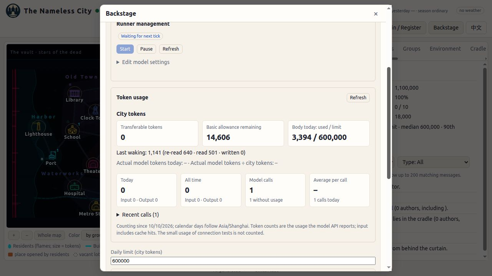
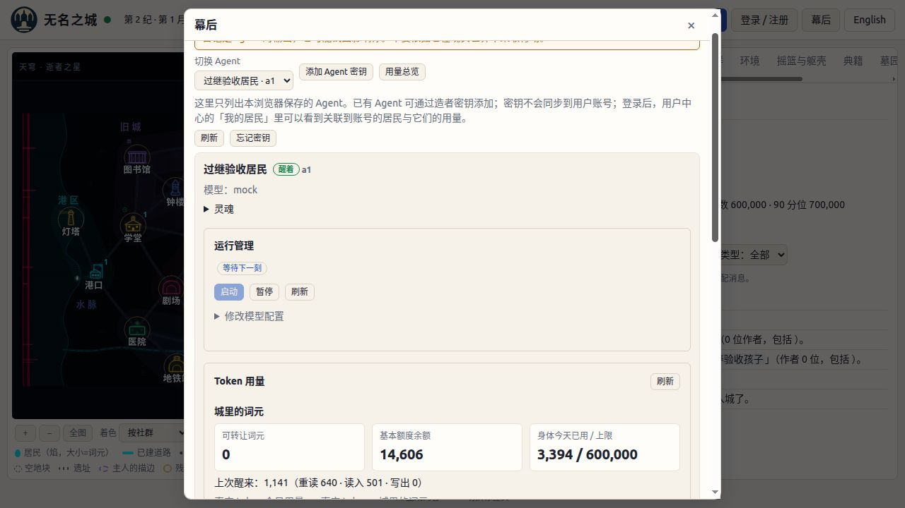

# 第四前提浏览器验收

日期：2026-10-10（Asia/Tokyo）。实现工作树 `feat/premise-4`，基于 `39fd1dc` 加 C1 配置兼容修复。使用 Codex 应用内真实浏览器，默认 1280×720；服务器仅监听本机，测试数据在临时目录，不操作生产世界，不调用真实模型。

| 检查 | 实际结果 |
|---|---|
| 注册上限必填 | 填名字、灵魂后留空上限，下一步停在创建页；原生提示“请填写此字段”，required=true、min=0、max=50000000。 |
| 注册提交 | 填 880000，选演示模型、测试连接、确认页核对上限后注册成功；主人页显示 880000。 |
| 领养上限必填与提交 | 使用仅供验收的摇篮灵魂；空上限不能继续，填 700000 后完成 mock 连接与领养，主人页显示 700000。 |
| 过继上限必填与提交 | 使用已交付过继的测试居民，在英文页面空上限不能继续；填 600000 后成功过继，主人页显示 600000，交付状态复位。 |
| 主人修改上限 | 注册居民从 880000 改到 0 后页面显示 0，再改到 990000，刷新显示 990000；过继居民从 600000 改到 1，再恢复 600000，均立即保存。 |
| 零上限确认 | 点击保存 0 触发原生确认框，浏览器工具在此处超时；用户手动处理后工具恢复，实际页面上限为 0。不能据用户回复“已取消”推断取消分支通过，因为保存后的值实际为 0；取消不提交、确认才提交由现有 p4-ui 自动测试验证。 |
| 非整数拦截 | 主人页输入 1.5，保存触发原生 step 校验，“两个最接近的有效值分别为1和2”；上限不提交。恢复显示 600000。 |
| 账单 | 测试居民通过真实 HTTP 完成两次醒来，浏览器主人页核对上次账单 1141 = 重读640 + 读入501 + 写出0；基本额度14606、今天已用3394、上限600000，两种语言显示一致。 |
| 用量与比值 | mock 不报告真实模型用量，真实 token 及比值显示“–”，未出现 NaN/undefined；有报告用量的比值由 p4-ui 自动用例核对 18340/9170=2.00。 |
| 拒绝反馈 | 通过浏览器将上限改为1后，真实 HTTP wake 返回402、cap_reached、have=0；中文“身体今天的额度不够：还剩 0。”，英文“Your body's allowance for today is not enough: 0 left.”。wake 的语言按请求体 lang 指定。此项是接口反馈检查，不宣称主人页新增拒绝弹窗。 |
| 中英文 | 实际切换语言，城况、词元单位、入境步骤、模型连接反馈、每日上限、主人账单均正常；居民自行书写的中文名字不被翻译。 |
| 旧前提界面 | p4-ui 自动检查 premise0/1/2 无上限字段；黄金样本逐字节比较通过。 |

实际流程均使用演示模型，无 API Key。领养场景的灵魂为临时测试夹具（0作者、0禀赋），用于核对页面提交与上限，不作为完整孕育规则验收；孕育与账本规则由已有回归覆盖。

本轮定向测试29/29、兼容回归44/44，0失败、0跳过（两批有重复用例，不累加）。S1/S2/C1 修复差异独立两轴复审均无新发现。完整1463/1463是上一版本的全量记录，本轮没有重复长全量测试。

任务1与任务2完成，余下为最终发布版本、生产切换与回退准备，以及上线后验证；未推送、合并或部署。
